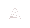

# 🚗 Antisocials56 - Детейлинг №1

<div align="center">
  
  
  <h3>Профессиональный детейлинг автомобилей в Оренбурге</h3>
  
  [](https://ilyakhar.github.io/antisocials56.io/)
  [](https://developer.mozilla.org/en-US/docs/Web/HTML)
  [](https://sass-lang.com/)
  [](https://developer.mozilla.org/en-US/docs/Web/JavaScript)
</div>

---

## 🎯 О проекте

**Antisocials56** - это современный веб-сайт для детейлинг-студии, специализирующейся на премиальном уходе за автомобилями. Сайт создан с использованием современных веб-технологий и обеспечивает отличный пользовательский опыт на всех устройствах.

### ✨ Основные возможности

- 🎨 **Современный дизайн** - Адаптивный интерфейс с красивыми анимациями
- 📱 **Мобильная версия** - Оптимизирован для всех устройств
- 🚀 **Быстрая загрузка** - Оптимизированный код и ресурсы
- 🎯 **Интерактивность** - Плавные переходы и эффекты
- 📋 **Форма заказа** - Удобная система выбора услуг

## 🛠️ Технологии

| Технология | Описание |
|------------|----------|
| **HTML5** | Семантическая разметка |
| **Sass/SCSS** | Препроцессор CSS для стилизации |
| **JavaScript** | Интерактивность и анимации |
| **jQuery** | Упрощение работы с DOM |
| **Responsive Design** | Адаптивная верстка |

## 🚀 Услуги

### 🎨 Оклейка автомобилей
- Защитная пленка
- Тонировка стекол
- Декоративная оклейка
- Антихром

### ✨ Детейлинг
- Полировка кузова
- Химчистка салона
- Защитные покрытия
- Полный уход за авто

## 📁 Структура проекта

```
antisocials56.io/
├── assets/
│   ├── css/           # Стили (Sass/SCSS)
│   │   ├── base/      # Базовые стили
│   │   ├── layouts/   # Сетка и макеты
│   │   └── modules/   # Компоненты
│   ├── img/           # Изображения
│   └── js/            # JavaScript файлы
├── index.html         # Главная страница
└── README.md          # Документация
```

## 🎨 Дизайн-система

### Цветовая палитра
- **Основной**: Темно-синий (#1a1a2e)
- **Акцентный**: Золотой (#ffd700)
- **Текст**: Белый (#ffffff)
- **Фон**: Градиенты и текстуры

### Типографика
- **Шрифт**: Montserrat (Regular, Bold, Light, Black)
- **Размеры**: Адаптивная типографика

## 🚀 Установка и запуск

1. **Клонируйте репозиторий**
   ```bash
   git clone https://github.com/IlyaKhar/antisocials56.io.git
   cd antisocials56.io
   ```

2. **Откройте в браузере**
   ```bash
   # Просто откройте index.html в браузере
   open index.html
   ```

3. **Для разработки с Sass**
   ```bash
   # Установите Sass
   npm install -g sass
   
   # Компилируйте стили
   sass assets/css/main.sass assets/css/main.css --watch
   ```

## 📱 Адаптивность

Сайт полностью адаптивен и корректно отображается на:
- 📱 Мобильных устройствах (320px+)
- 📱 Планшетах (768px+)
- 💻 Десктопах (1024px+)
- 🖥️ Больших экранах (1440px+)

## 🎯 Особенности

- **3D эффекты** - Использование CSS transforms
- **Плавные анимации** - CSS transitions и keyframes
- **Интерактивные элементы** - Hover эффекты и переходы
- **Оптимизация** - Минифицированные ресурсы
- **SEO готовность** - Семантическая разметка

## 📞 Контакты

- **Адрес**: Авиационная улица, 12, Оренбург, Россия
- **Email**: ilyuha969@mail.ru
- **Телефон**: +7 (953) 458-55-80

## 🤝 Вклад в проект

Мы приветствуем вклад в развитие проекта! Если у вас есть предложения по улучшению:

1. Форкните репозиторий
2. Создайте ветку для новой функции
3. Внесите изменения
4. Создайте Pull Request

## 📄 Лицензия

Этот проект распространяется под лицензией MIT. Подробности в файле [LICENSE](LICENSE).

---

<div align="center">
  <p>Сделано с ❤️ для любителей качественного детейлинга</p>
  <p>© 2024 Antisocials56. Все права защищены.</p>
</div>
